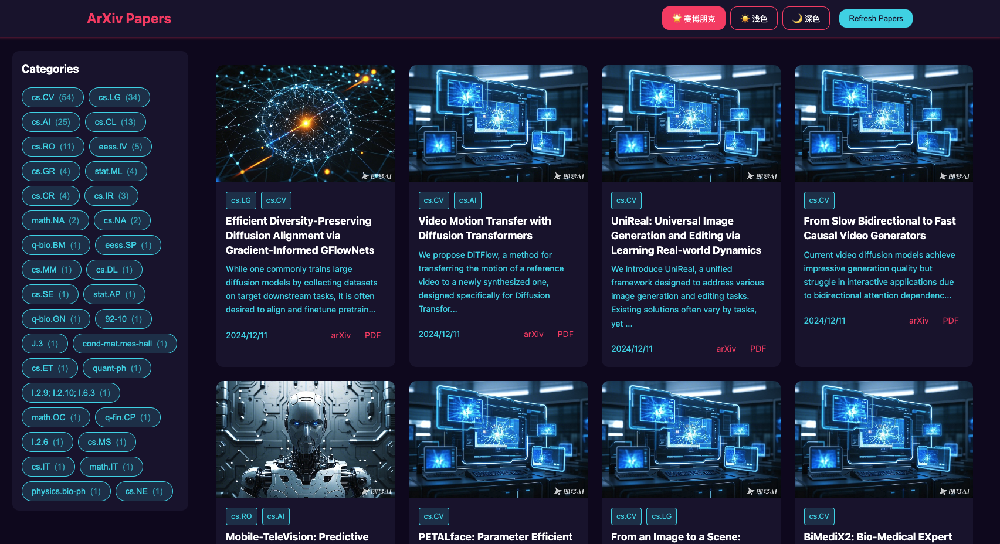

# ArXiv Paper Browser

A modern ArXiv paper browser that makes academic surfing enjoyable. Features a beautiful card-based interface, smart category filtering, and real-time updates. Your daily companion for discovering cutting-edge research papers in computer science and beyond.

Built with Vue.js and Python FastAPI.



## Features

- 📱 Responsive card-based interface
- 🎨 Three beautiful themes (Cyberpunk, Light, Dark)
- 🔍 Filter papers by categories
- 🔄 Real-time paper updates
- 📊 Category statistics
- 🖼 Custom images for popular categories
- 🚀 Fast and efficient

## Tech Stack

### Frontend
- Vue 3 with Composition API
- Vite for build tooling
- Pinia for state management
- SCSS with theme support
- Axios for API calls

### Backend
- FastAPI
- SQLite database
- ArXiv API integration
- Background scheduling

## Getting Started

### Prerequisites
- Python 3.8+
- Node.js 16+
- npm or yarn

### Installation

1. Clone the repository
```bash
git clone https://github.com/yourusername/arxiv-paper-browser.git
cd arxiv-paper-browser
```
2. Set up the backend
```bash
cd backend
python -m venv venv
source venv/bin/activate # On Windows: .\venv\Scripts\activate
pip install -r requirements.txt
```
3. Set up the frontend
```bash
cd frontend
npm install
```
### Running the Application

You can run both frontend and backend with a single command:
```bash
python start.py
```
Or run them separately:

Backend:
```bash
cd backend
python -m main
```
Frontend:
```bash
cd frontend
npm run dev
```
The application will be available at:
- Frontend: http://localhost:5173
- Backend API: http://localhost:8000
- API Documentation: http://localhost:8000/docs

## Project Structure
```
.
├── backend/
│ ├── database/ # Database models and operations
│ ├── scraper/ # ArXiv API integration
│ ├── tests/ # Backend tests
│ └── main.py # FastAPI application
├── frontend/
│ ├── public/ # Static assets
│ └── src/
│ ├── assets/ # Styles and images
│ ├── components/ # Vue components
│ ├── stores/ # Pinia stores
│ └── views/ # Page components
└── start.py # Development startup script

```
## Contributing

1. Fork the repository
2. Create your feature branch (`git checkout -b feature/AmazingFeature`)
3. Commit your changes (`git commit -m 'Add some AmazingFeature'`)
4. Push to the branch (`git push origin feature/AmazingFeature`)
5. Open a Pull Request

## License

This project is licensed under the MIT License - see the [LICENSE](LICENSE) file for details.

## Acknowledgments

- [ArXiv API](https://arxiv.org/help/api/index) for providing the paper data
- [Vue.js](https://vuejs.org/) for the excellent frontend framework
- [FastAPI](https://fastapi.tiangolo.com/) for the powerful backend framework